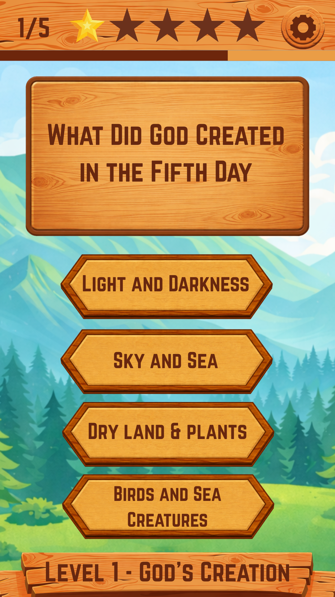
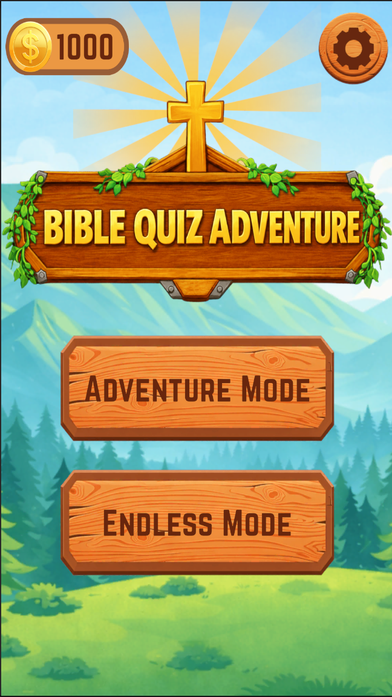
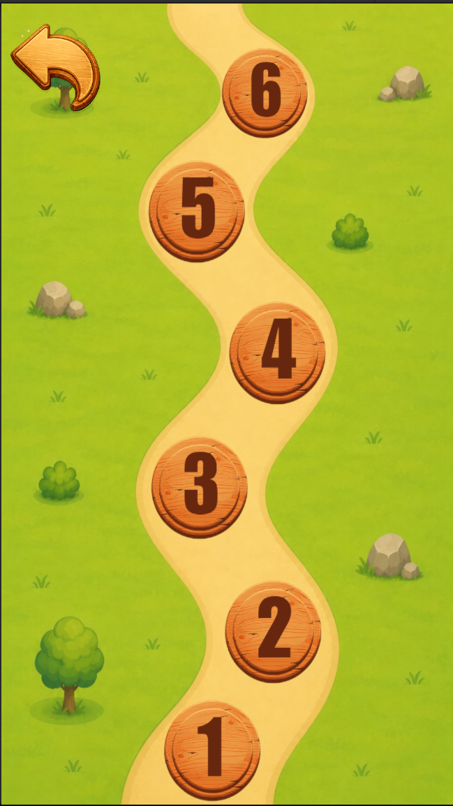

# 📖 Bible Quiz Adventure

## Status

✅ Version 1.0 Released

📱 Android

🌐 WebGL

🎮 Portfolio Project

🛠 Actively Maintained

> An interactive Christian educational game that transforms Bible learning into an engaging adventure through level progression, exploration, and challenge-based gameplay.

---

## Overview

Bible Quiz Adventure is a cross-platform Christian educational quiz game built with Unity 6 and C#, featuring story-driven progression, persistent save systems, and a scalable manager-based architecture. The project demonstrates modern Unity development practices while making Bible learning engaging and accessible.

---

## Downloads

### Windows Version

[Download for Windows](YOUR_WINDOWS_DOWNLOAD_LINK)

### Android Version

[Download for Android](YOUR_ANDROID_DOWNLOAD_LINK)

---

## Project Information

| Category | Details |
|-----------|---------|
| Project Type | Christian Educational Quiz Game |
| Platforms | Android, Windows |
| Engine | Unity |
| Programming Language | C# |
| Game Modes | Adventure Mode, Endless Mode |
| Target Audience | Bible Learners of All Ages |
| Development Type | Solo Developer Project |
| Deployment Status | Successfully Deployed |

---

## Architecture

Bible Quiz Adventure was designed using a data-driven architecture to support scalable content creation and future expansion.

Core systems include:

- Quiz Manager
- Adventure Progression Manager
- Save System
- Question Database
- UI Management System
- Endless Mode Framework

The game uses a reusable Quiz Scene where level content is dynamically loaded rather than relying on scene-per-level design.

---

## Core Gameplay

### Adventure Mode

Progress through a structured journey of Bible-themed levels featuring carefully curated questions based on biblical stories, characters, teachings, and events.

Players must complete stages, earn stars, and unlock new levels as they continue their adventure through Scripture.

### Endless Mode

Challenge yourself against the clock and answer as many Bible questions as possible before time runs out.

Designed for replayability, Endless Mode encourages players to improve their knowledge while competing against their personal best scores.

### Learn Through Play

Questions are designed to reinforce biblical understanding while maintaining an engaging gameplay loop that encourages continued learning and progression.

---

## Key Features

### Level-Based Progression

Unlock new stages as you complete Bible-themed challenges and advance through the adventure.

### Structured Bible Learning

Questions are organized around important biblical stories, teachings, and historical events.

### Endless Challenge Mode

Fast-paced gameplay that rewards quick thinking and biblical knowledge.

### Star Reward System

Track your performance and progress through a rewarding achievement system.

### Mobile-Friendly Interface

Designed specifically for Android devices with intuitive portrait-oriented gameplay.

### Educational Game Design

Combines gamification principles with biblical education to create meaningful learning experiences.

---

## Screenshots

<table>
<tr>
<td align="center">
<b>Quiz Gameplay</b> 

</td>

<td align="center">
<b>Main Menu</b> 

</td>

<td align="center">
<b>Adventure Map</b> 

</td>
</tr>
</table>

---

## Project Highlights

- Developed as a complete Bible-learning game experience
- Features both Adventure Mode and Endless Mode
- Designed for Android and Windows platforms
- Implements scalable level progression architecture
- Encourages biblical learning through interactive gameplay
- Combines education, gamification, and user engagement principles
- Built as a standalone educational game product

---

## Gameplay Demo

Watch a short gameplay demonstration showcasing Adventure Mode, level progression, and Endless Mode gameplay.

🎥 Bible Quiz Adventure Gameplay Demo

[Watch Gameplay Demo](YOUR_VIDEO_LINK)

---

## Technologies Used

- Unity Engine
- C#
- TextMeshPro
- Unity UI System
- PlayerPrefs Save System
- Mobile Game Development
- Android Build Pipeline
- Windows Build Pipeline
- Git & GitHub

---

## My Contributions

As the sole developer of Bible Quiz Adventure, I was responsible for:

- Game Design
- UI/UX Design
- Gameplay Programming
- Quiz System Development
- Level Progression System
- Endless Mode Development
- Save System Implementation
- Android and Windows Deployment
- Testing and Optimization

---

## Future Improvements

- Additional Bible Stories and Events
- Expanded Question Database
- Achievement System
- Daily Challenges
- Online Leaderboards
- Cloud Save Support
- Additional Educational Game Modes

---

## Technical Challenges

During development, several gameplay systems were designed and implemented:

- Dynamic question management system
- Adventure mode progression architecture
- Endless mode timer framework
- Persistent player progression
- Star-based completion system
- Mobile-responsive UI implementation
- Data-driven quiz structure
- Cross-platform deployment pipeline

---

## Developer

**David Nathaniel Miranda**

Software Developer | Unity Game Developer | Web Developer

GitHub:  
[David Miranda GitHub](https://github.com/davidmiranda-gamedev)

LinkedIn:  
[David Miranda LinkedIn](https://www.linkedin.com/in/davidnmiranda/)

---

⭐ If you enjoyed this project, feel free to explore my other repositories and educational game projects.
